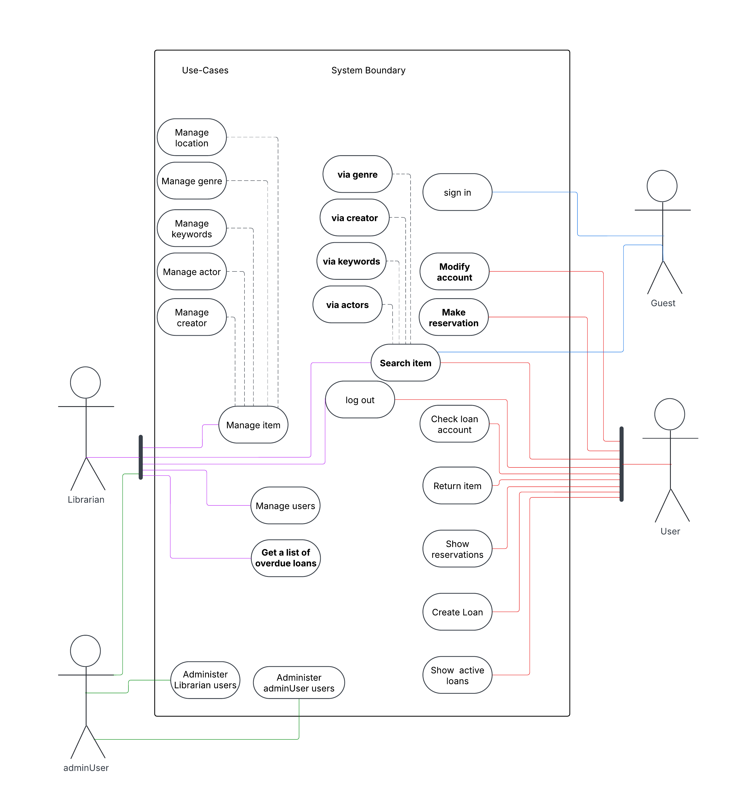

[← Back to Index](0_index.md)

# Use Case Modeling

We created a **Use Case Diagram** to visualize the interaction between users and the system. This helped define scope and guided feature prioritization.

